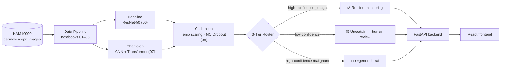

<div align="center">

# 🩺 SafeDerm

**Calibrated, uncertainty-aware skin lesion triage for primary care.**

AI-assisted classification of dermatoscopic images into 7 diagnostic categories — with confidence-tiered routing so the system says *"I'm not sure, send this to a human"* instead of guessing.

[](LICENSE)
[](pyproject.toml)
[](#roadmap)
[](https://www.kaggle.com/datasets/kmader/skin-cancer-mnist-ham10000)
[](https://github.com/kashish-sachdeva-ds/safederm/actions/workflows/ci.yml)

</div>

---

## Table of Contents

- [Scope & Safety](#scope--safety)
- [Overview](#overview)
- [How It Works](#how-it-works)
- [Dataset](#dataset)
- [Project Structure](#project-structure)
- [Getting Started](#getting-started)
- [Running the Pipeline](#running-the-pipeline)
- [Current Results](#current-results--baseline-resnet-50)
- [Architecture Decisions](#architecture-decisions)
- [Tech Stack](#tech-stack)
- [Roadmap](#roadmap)
- [Team](#team)
- [License](#license)

---

## Scope & Safety

> [!WARNING]
> SafeDerm screens for **7 specific dermoscopic lesion types** (listed below). It is **not** a general-purpose skin diagnosis tool, is **not** designed to identify other skin conditions (eczema, acne, psoriasis, burns, etc.), and is **not** a substitute for professional medical evaluation. Always consult a dermatologist for any skin concern.

## Overview

Skin cancer screening is time-intensive, and dermatologist access is limited — especially in primary care settings. SafeDerm classifies a dermatoscopic image into one of 7 diagnoses, groups the result into a malignant/benign risk category, and routes it through a **3-tier confidence system** — `normal` / `concerning` / `uncertain` — rather than handing back a single raw probability that's easy to over-trust.

| Doc | Covers |
|---|---|
| `docs/decisions/ADR-001` | Business problem framing |
| `docs/decisions/ADR-002` | Why 3-tier routing instead of a raw probability |

## How It Works



## Dataset

[**HAM10000**](https://www.kaggle.com/datasets/kmader/skin-cancer-mnist-ham10000) ("Human Against Machine with 10000 training images") — 10,015 dermatoscopic images across 7 diagnostic classes:

| Risk group | Classes |
|---|---|
| **Malignant** (needs referral) | melanoma (`mel`), basal cell carcinoma (`bcc`), actinic keratosis (`akiec` — precancerous) |
| **Benign** | melanocytic nevi (`nv`), benign keratosis (`bkl`), dermatofibroma (`df`), vascular lesions (`vasc`) |

- Grouping rationale — including why precancerous `akiec` is treated as malignant — is in `docs/decisions/ADR-004`.
- The train/val/test split is **lesion-level, not image-level**, and stratified by class, so that photos of the same lesion never leak across splits. See `docs/decisions/ADR-003`.

## Project Structure

```
SafeDerm/
├── api/                          # FastAPI serving layer
│   ├── main.py                     # /predict, /health
│   └── test_main.py
├── frontend/                     # React (Vite) upload + result UI
│   └── src/
├── data/
│   ├── raw/                        # HAM10000 images + metadata (gitignored — see Getting Started)
│   └── processed/                  # train/val/test split CSVs
├── docs/
│   └── decisions/                  # ADRs — architectural decision records
├── models/                       # trained checkpoints + calibration artifact (gitignored — see Releases)
├── notebooks/                    # numbered, phase-gated pipeline
├── src/                           # reusable code — single source of truth
│   ├── config.py                    # paths and constants
│   ├── labels.py                     # class definitions, malignant/benign grouping
│   ├── transforms.py                  # image preprocessing / augmentation
│   ├── dataset.py                      # PyTorch Dataset
│   ├── model.py                         # architectures (baseline + champion)
│   ├── engine.py                         # training/eval loops, shared metrics
│   └── calibration.py                    # temperature scaling, MC Dropout, 3-tier routing
├── .github/workflows/ci.yml       # runs api/test_main.py + frontend build on every push/PR
├── pyproject.toml
├── requirements.txt
├── requirements-gpu.txt           # optional, for local CUDA training outside Colab/Kaggle
└── requirements-dev.txt
```

## Getting Started

### Backend / Modeling

```bash
git clone https://github.com/kashish-sachdeva-ds/safederm.git
cd safederm
python -m venv venv
source venv/bin/activate          # Windows: venv\Scripts\activate

pip install -r requirements.txt   # CPU by default — see requirements-gpu.txt for local NVIDIA training
pip install -e .                  # installs the project itself so `from src...` imports work from any notebook
```

Then grab the dataset — see `notebooks/01_data_extraction.ipynb`, which supports both the Kaggle CLI (needs `~/.kaggle/kaggle.json`) and a manual download. Either way, drop the zip in `data/raw/` and the notebook handles extraction.

**Optional** — skip training and use a pretrained checkpoint: download one from the [Releases](https://github.com/kashish-sachdeva-ds/safederm/releases) page and place it in `models/`.

### API

```bash
cd api
pip install -r requirements.txt   # self-sufficient — also pulls in the root requirements.txt
uvicorn api.main:app --reload
```

Configurable via env vars:

| Variable | Values | Default |
|---|---|---|
| `SAFEDERM_MODEL_VARIANT` | `baseline` \| `champion` | `baseline` |
| `SAFEDERM_ALLOWED_ORIGINS` | comma-separated origins | covers local frontend dev |

Or skip the manual setup entirely: `docker compose up` runs the whole stack containerized.

### Frontend

```bash
cd frontend
npm install
npm run dev
```

Expects the API at `http://localhost:8000` by default — copy `.env.example` to `.env.local` to point it elsewhere.

## Running the Pipeline

Notebooks are numbered and phase-gated — each depends on the previous one's output, so run them in order:

| # | Notebook | Purpose | Status |
|---|---|---|---|
| 01 | `01_data_extraction.ipynb` | Download, extract, consolidate HAM10000 | ✅ Done |
| 02 | `02_data_understanding.ipynb` | Inspect metadata, lesion-level train/val/test split | ✅ Done |
| 03 | `03_eda.ipynb` | Class balance, demographics, sample images (train split only) | ✅ Done |
| 04 | `04_feature_engineering.ipynb` | Image preprocessing/augmentation pipeline | ✅ Done |
| 05 | `05_pipeline.ipynb` | PyTorch Dataset/DataLoader, batch sanity checks | ✅ Done |
| 06 | `06_baseline_model.ipynb` | ResNet-50 baseline, weighted loss, two-phase recipe (ADR-006) | 🔶 Recipe updated — needs a fresh run |
| 07 | `07_champion_model.ipynb` | CNN + Transformer architecture | 🔶 Code complete — needs a training run |
| 08 | `08_calibration_conformal.ipynb` | Temperature scaling, MC Dropout, ECE/MCE/Brier, 3-tier thresholds, OOD stress test | 🔶 Code complete — needs `07`'s checkpoint first |

> [!NOTE]
> 🔶 means the code is written and tested (unit + integration tests against synthetic data) but hasn't run against the real dataset yet. "The pipeline works" and "we have real numbers from it" are different claims — this status stays 🔶 until there's an actual run behind it.

## Current Results — Baseline (ResNet-50)

| Metric | Value |
|---|---|
| Validation accuracy | 77.4% |
| Malignant recall | 83.1% (255/308 correctly flagged) |
| Missed malignant cases | 52 (17%) |

**These numbers are from the original single-LR, fixed-10-epoch recipe** — the training curve behind them shows clear overfitting past epoch 5 (see `ADR-006`). `06` has since been updated to a two-phase warmup + discriminative-LR + early-stopping recipe; re-running it will produce a new — and more honestly trained — number to replace this table with. This is the bar `07`'s architecture needs to clear, specifically on **malignant recall**, not just overall accuracy.

Full per-class report and confusion matrix live in `06_baseline_model.ipynb`. Class-imbalance handling (weighted loss) is documented in `docs/decisions/ADR-005`.

## Architecture Decisions

Every significant design decision is recorded in `docs/decisions/`:

| ADR | Decision |
|---|---|
| **ADR-001** | Business problem framing |
| **ADR-002** | Technical architecture (3-tier routing over raw probability) |
| **ADR-003** | Dataset split strategy — lesion-level, stratified |
| **ADR-004** | Malignant/benign risk grouping |
| **ADR-005** | Class imbalance handling (weighted loss) |
| **ADR-006** | Training recipe fix and champion model architecture |

## Tech Stack

| Layer | Stack |
|---|---|
| Modeling | PyTorch, ResNet-50 baseline, CNN + Transformer champion architecture |
| Calibration | Temperature scaling, MC Dropout, conformal-style 3-tier routing |
| Backend | FastAPI, served via Uvicorn, Dockerized |
| Frontend | React + Vite |
| CI | GitHub Actions — API tests + frontend build on every push/PR |
| Tooling | Jupyter notebooks (phase-gated pipeline), pyright |

## Roadmap

- [x] Data pipeline (extraction → split → EDA → preprocessing)
- [x] Baseline model (recipe updated per ADR-006 — re-run pending)
- [x] CI (API tests + frontend build run automatically on push/PR)
- [x] FastAPI backend + Docker deployment
- [ ] Champion model (CNN + Transformer) — code complete, training run pending
- [ ] Calibration + 3-tier confidence system — code complete, pending `07`'s checkpoint
- [ ] Out-of-distribution / input safety testing — stress test built into `08`, pending a real run
- [ ] React frontend — scaffolded (upload + tiered result display), pending real backend results to design against
- [ ] Cost-sensitive business case, demo, final report

## Team

4-person project:

| Role | Focus |
|---|---|
| ML Engineer | Data pipeline, modeling, calibration |
| MLOps / Data | Infrastructure, data management |
| Backend Engineer | API, deployment |
| Frontend / Product | UI, product framing |

Full breakdown lives in the team's shared Notion workspace.

## License

See [`LICENSE`](LICENSE) (MIT).

---

<div align="center">
<sub>Built as an academic ML systems project. Not a certified medical device — see <a href="#scope--safety">Scope & Safety</a>.</sub>
</div>
