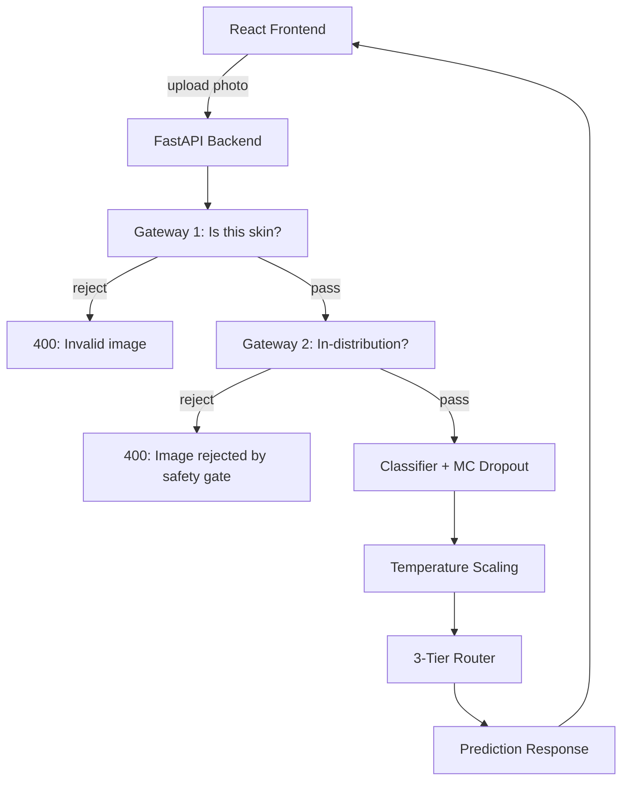
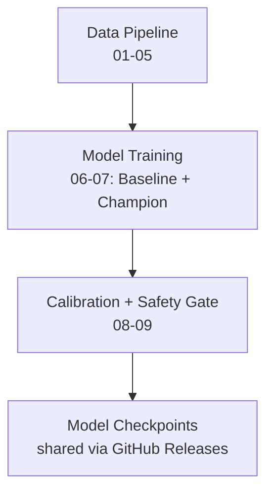

<p align="center">
  
  
  
  
  
</p>

<h1 align="center">SafeDerm 🛡️</h1>
<p align="center"><b>AI-Assisted Skin Lesion Triage System</b></p>
<p align="center">
  <i>Calibrated confidence. Uncertainty-aware routing. Two-layer input safety.<br>
  Not a diagnostic tool — a clinical decision support system.</i>
</p>

---

## 📋 Table of Contents

- [The Problem](#-the-problem)
- [The Solution](#-the-solution)
- [System Architecture](#-system-architecture)
- [Safety-First Design](#-safety-first-design)
- [Model Variants](#-model-variants)
- [Project Structure](#-project-structure)
- [Dataset & Splits](#-dataset--splits)
- [Training Pipeline](#-training-pipeline)
- [API Specification](#-api-specification)
- [Getting Started](#-getting-started)
- [Configuration](#-configuration)
- [Architecture Decisions (ADRs)](#-architecture-decisions-adrs)
- [Known Limitations](#-known-limitations)
- [License](#-license)

---

## 🎯 The Problem

In first-line clinics and small hospitals, patients present with skin spots or moles, but the attending clinician may not be a dermatologist. The current options create a painful trilemma:

1. **Over-referral** — Benign cases are sent to specialist centers unnecessarily, wasting capacity, patient time, and money.
2. **Missed malignancy** — A genuinely concerning lesion is incorrectly cleared locally because the system was "confident" but wrong.
3. **Uncertainty paralysis** — Cases that should remain referred are forced into a binary yes/no decision.

> **Core Question:** *How can SafeDerm reduce avoidable specialist referrals and improve patient flow at first-line clinics while ensuring that uncertainty or model error does not result in a genuinely concerning lesion being incorrectly cleared?*

---

## 💡 The Solution

SafeDerm is a **three-way triage system**, not a binary classifier. It accepts a dermatoscopic image and returns one of three operational outcomes:

| Tier | Outcome | Clinical Action |
|------|---------|-----------------|
| 🟢 **Normal** | High-confidence benign | Local handling / no specialist referral |
| 🔴 **Concerning** | High-confidence malignant | Refer to specialist care promptly |
| 🟡 **Uncertain** | Insufficient reliable evidence | **Remain referred** — do not force a local clearance |

This is achieved through a rigorous technical stack:

- **7-class classification** on HAM10000 (akiec, bcc, bkl, df, mel, nv, vasc)
- **Malignant/Benign risk grouping** with safety-conservative boundaries
- **Temperature-scaled calibration** so confidence scores are trustworthy
- **MC Dropout uncertainty estimation** to detect when the model is out of its depth
- **Two-layer input safety gate** to reject non-skin and out-of-distribution inputs before they ever reach the classifier

---

## 🏗️ System Architecture

### Request Flow (Runtime)



### Training Pipeline



| Stage | Notebooks | Output |
|-------|-----------|--------|
| Data Pipeline | `01_data_extraction` → `05_pipeline` | Lesion-level train/val/test splits, PyTorch `Dataset`/`DataLoader` |
| Model Training | `06_baseline_model`, `07_champion_model` | Trained checkpoints, compared head-to-head on the same test set |
| Calibration + Safety | `08_calibration_conformal`, `09_input_gate` | `calibration.json` (temperature + tier thresholds), gate checkpoint |
| Deployment | — | Checkpoints published as GitHub Releases, consumed by `/predict` |

---

## 🛡️ Safety-First Design

SafeDerm operates on a **"reject first, classify second"** philosophy.

### Gateway 1: Far-OOD Detection (Is this even skin?)
A zero-shot **BiomedCLIP** model evaluates the uploaded image against multiple positive and negative prompts before the clinical model sees it.

- **Positive prompts:** *"a close-up medical photograph of human skin with a mole, lesion, or rash"*, *"a dermatology photo of a skin condition"*
- **Negative prompts:** *"a photograph of a random object, scenery, animal, or person"*, *"a close-up macro photograph of an inanimate object or material"*
- **Aggregation:** Skin-side probabilities are summed and compared against a tunable threshold (`GATEWAY_THRESHOLD = 0.76`)

### Gateway 2: Near-OOD Detection (Is this the *kind* of skin we trained on?)
Even real skin can fool the system if the lighting, zoom, or lesion type is wildly out-of-distribution. Gateway 2 uses **k-NN distance in model embedding space** (Sun et al., ICML 2022):

1. Build a **Feature Bank** from the training set's embeddings (L2-normalized ResNet-50 `avgpool` for baseline; transformer-head extraction for champion)
2. At inference, compute the k-th nearest neighbor distance between the query image and the bank
3. Reject if distance exceeds the architecture-specific threshold

> ⚠️ **Critical:** Feature banks and thresholds are **not transferable across architectures**. A threshold tuned on ResNet-50 embeddings will not work for the Transformer champion model. Rebuild per variant.

---

## 🧠 Model Variants

SafeDerm supports two model architectures, selectable via the `SAFEDERM_MODEL_VARIANT` environment variable.

| | **Baseline** | **Champion** |
|---|---|---|
| **Architecture** | ResNet-50 (ImageNet-pretrained) | ResNet-50 backbone + Transformer encoder head |
| **Head** | Linear FC (7 outputs) | `_TransformerHead`: CLS token + 8-head self-attention over 7×7 spatial grid |
| **Parameters** | ~25M | ~25M + Transformer head |
| **Pretrained Weights** | `ResNet50_Weights.IMAGENET1K_V2` | Same backbone weights; head is fresh |
| **Dropout** | ❌ None | ✅ `nn.Dropout(0.3)` in head (required for MC Dropout) |
| **Explainability** | Grad-CAM (post-hoc) | Native attention rollout over 49 patches |
| **Why it exists** | Simple, fast, proven | Attention maps provide literal "where did the model look" explanations |

### Champion Model Detail
The `_TransformerHead` projects the ResNet-50 final conv feature map (2048 channels, 7×7 spatial) into 256-dim tokens, prepends a learnable CLS token, adds positional embeddings, and runs a 3-layer Transformer encoder. The CLS token is then dropout-regularized and classified.

```python
# src/model.py — ChampionModel forward path
feature_map = self.backbone(x)        # [B, 2048, 7, 7]
return self.transformer_head(feature_map)  # [B, 7] logits
```

---

## 📁 Project Structure

```
safederm/
├── .github/workflows/ci.yml      # GitHub Actions: pytest + lint
├── api/
│   ├── __init__.py
│   ├── main.py                   # FastAPI app, /predict + /health
│   ├── requirements.txt          # fastapi, uvicorn, python-multipart
│   └── test_main.py              # Integration tests (TestClient)
├── data/
│   ├── raw/                      # HAM10000 images + metadata (gitignored)
│   └── processed/                # train_split.csv, val_split.csv, test_split.csv
├── docs/
│   ├── SYSTEM_DESIGN.md          # Full system design document
│   └── decisions/                # Architecture Decision Records (ADRs)
│       ├── ADR-001-business-problem-framing-safederm.md
│       ├── ADR-002-safederm-technical-architecture.md
│       ├── ADR-003-dataset-split-strategy-safederm.md
│       ├── ADR-004-risk-grouping-safederm.md
│       ├── ADR-005-class-imbalance-weighted-loss-safederm.md
│       └── ADR-006-training-recipe-and-champion-model.md
├── frontend/                     # React 19 + TypeScript + Vite
│   ├── index.html
│   ├── package.json
│   ├── vite.config.ts
│   └── src/
│       ├── App.tsx               # Upload UI + result display (WIP)
│       ├── main.tsx
│       └── ...
├── models/                       # Checkpoints + artifacts (gitignored)
│   ├── baseline_resnet50.pt
│   ├── champion_transformer.pt
│   ├── calibration.json
│   ├── feature_bank_baseline.pt
│   └── feature_bank_champion.pt
├── notebooks/
│   ├── 01_data_extraction.ipynb
│   ├── 02_data_understanding.ipynb
│   ├── 03_eda.ipynb
│   ├── 04_data_preparation.ipynb
│   ├── 05_pipeline.ipynb
│   ├── 06_baseline_model.ipynb
│   ├── 07_champion_model.ipynb
│   ├── 08_calibration_conformal.ipynb
│   └── 09_input_gate.ipynb
├── src/                          # Single source of truth for all reusable logic
│   ├── __init__.py
│   ├── config.py                 # All file paths, constants, dataset slug
│   ├── labels.py                 # ALL_CLASSES, MALIGNANT_CLASSES, risk_group()
│   ├── transforms.py             # get_train_transforms(), get_eval_transforms()
│   ├── dataset.py                # SkinLesionDataset (PyTorch)
│   ├── model.py                  # build_baseline_model(), build_champion_model()
│   ├── engine.py                 # set_seed(), compute_class_weights(), fit()
│   ├── calibration.py            # TemperatureScaler, MC Dropout, 3-tier router
│   ├── gateway.py                # BiomedCLIP skin verifier (Gateway 1)
│   └── near_ood.py               # Feature bank + k-NN distance (Gateway 2)
├── Dockerfile
├── docker-compose.yml
├── pyproject.toml
├── requirements.txt              # Core: torch, torchvision, fastapi, pandas, etc.
├── requirements-gpu.txt
├── requirements-dev.txt          # pytest, httpx
├── requirements-gateway.txt      # open_clip_torch, transformers
├── run_baseline.bat
├── run_champion.bat
└── test_crash.py                 # Crash reproduction / smoke test
```

---

## 📊 Dataset & Splits

**Primary Dataset:** [HAM10000](https://dataverse.harvard.edu/dataset.xhtml?persistentId=doi:10.7910/DVN/DBW86T) (10,015 dermatoscopic images, 7 diagnostic categories)

| Class | Description | Risk Group |
|-------|-------------|------------|
| `akiec` | Actinic Keratosis / Intraepithelial Carcinoma | 🔴 **Malignant** (precancerous — safety-conservative) |
| `bcc` | Basal Cell Carcinoma | 🔴 **Malignant** |
| `bkl` | Benign Keratosis | 🟢 **Benign** |
| `df` | Dermatofibroma | 🟢 **Benign** |
| `mel` | Melanoma | 🔴 **Malignant** |
| `nv` | Melanocytic Nevus | 🟢 **Benign** |
| `vasc` | Vascular Lesion | 🟢 **Benign** |

### Split Strategy (ADR-003)
- **Unit:** `lesion_id`, not `image_id` — prevents data leakage from multiple photos of the same mole
- **Ratio:** 70% train / 15% val / 15% test
- **Stratification:** By `dx` to preserve rare classes (`df`: 1.0%, `vasc`: 1.3%)
- **Reproducibility:** `random_state=42`

| Split | Lesions | Images | nv % | mel % | df % |
|-------|---------|--------|------|-------|------|
| Train | 5,229 | 6,981 | 67.1 | 11.1 | 1.0 |
| Val | 1,120 | 1,532 | 66.4 | 11.3 | 1.6 |
| Test | 1,121 | 1,502 | 66.8 | 11.1 | 1.3 |

**Class Weights** (inverse frequency, computed in `src/engine.py`):
```
akiec: 4.492 | bcc: 2.763 | bkl: 1.292 | df: 14.046 | mel: 1.290 | nv: 0.213 | vasc: 10.074
```

---

## 🏋️ Training Pipeline

All notebooks are **phase-gated** — each stage depends only on the previous stage's saved outputs (split CSVs, checkpoints), never on re-running earlier notebooks live.

| # | Notebook | Purpose |
|---|----------|---------|
| 01 | `01_data_extraction.ipynb` | Download HAM10000 from Kaggle, merge metadata, consolidate images |
| 02 | `02_data_understanding.ipynb` | Validate image counts, class labels, lesion_id integrity |
| 03 | `03_eda.ipynb` | Class distribution, age/sex breakdown, image quality checks |
| 04 | `04_data_preparation.ipynb` | Lesion-level stratified split, hard assert zero leakage |
| 05 | `05_pipeline.ipynb` | PyTorch Dataset & DataLoader construction |
| 06 | `06_baseline_model.ipynb` | Train ResNet-50 baseline with weighted CE loss |
| 07 | `07_champion_model.ipynb` | Train CNN+Transformer hybrid; head-to-head comparison |
| 08 | `08_calibration_conformal.ipynb` | Temperature scaling + MC Dropout threshold fitting |
| 09 | `09_input_gate.ipynb` | BiomedCLIP threshold tuning + near-OOD feature bank build |

### Training Recipe (ADR-006)
- **Reproducibility:** `set_seed(42)` for Python, NumPy, Torch, CUDA
- **Two-phase fine-tuning:**
  1. **Warmup:** Freeze backbone, train head only for 2 epochs (`HEAD_LR=1e-3`)
  2. **Unfreeze:** Full model with discriminative LR — `BACKBONE_LR=1e-5`, `HEAD_LR=1e-3`
- **Optimizer:** `AdamW` with `WEIGHT_DECAY=1e-4`
- **Scheduler:** `ReduceLROnPlateau` (drops LR when val loss stalls)
- **Early Stopping:** `EarlyStopper(patience=4)` — halts if no improvement in 4 epochs
- **Checkpoint Selection:** Weighted validation loss by default; `malignant_recall` available as alternative

---

## 🔌 API Specification

### Environment Variables

| Variable | Default | Description |
|----------|---------|-------------|
| `SAFEDERM_MODEL_VARIANT` | `baseline` | `baseline` or `champion` |
| `SAFEDERM_ALLOWED_ORIGINS` | `http://localhost:5173,http://localhost:3000` | CORS origins |
| `PYTHONUNBUFFERED` | `1` | Docker logging |

### Endpoints

#### `POST /predict`
Upload a skin image. Returns a triage decision.

**Request:** `multipart/form-data` with `file` (image, max 5MB)

**Response Schema (`PredictionResponse`):**
```json
{
  "diagnosis": "mel",
  "risk_group": "malignant",
  "tier": "concerning",
  "confidence": 0.91,
  "calibrated": true,
  "probabilities": {
    "akiec": 0.02, "bcc": 0.03, "bkl": 0.01,
    "df": 0.01, "mel": 0.91, "nv": 0.01, "vasc": 0.01
  },
  "model_variant": "champion"
}
```

**Tiers:** `normal` | `concerning` | `uncertain` | `not_calibrated`

**Error Responses:**
- `400` — Not an image file
- `400` — File exceeds 5MB
- `400` — Gateway 1 failed (not skin)
- `400` — Gateway 2 failed (out-of-distribution)
- `500` — Internal processing error (sanitized, never leaks tracebacks)

#### `GET /health`
Liveness and readiness probe.

**Response Schema (`HealthResponse`):**
```json
{
  "status": "ok",
  "model_loaded": true,
  "checkpoint_loaded": true,
  "model_variant": "champion",
  "calibration_loaded": true,
  "feature_bank_loaded": true
}
```

---

## 🚀 Getting Started

### Prerequisites
- Python ≥3.10
- Node.js ≥20 (for frontend)
- Docker & Docker Compose (optional)

### 1. Clone & Setup

```bash
git clone https://github.com/kashish-sachdeva-ds/safederm.git
cd safederm

# Python environment
python -m venv .venv
source .venv/bin/activate  # Windows: .venv\Scripts\activate
pip install -r requirements.txt
pip install -r requirements-dev.txt
pip install -r requirements-gateway.txt
```

### 2. Data Setup
Download HAM10000 from Kaggle and place in `data/raw/images/` and `data/raw/HAM10000_metadata.csv`, or run notebook `01_data_extraction.ipynb`.

### 3. Run Notebooks
Execute sequentially from `01` through `09`. Checkpoints and calibration artifacts will be written to `models/`.

### 4. Start API

```bash
# Baseline model
SAFEDERM_MODEL_VARIANT=baseline uvicorn api.main:app --reload

# Champion model
SAFEDERM_MODEL_VARIANT=champion uvicorn api.main:app --reload
```

Or use the batch helpers:
```bash
run_baseline.bat   # Windows
run_champion.bat   # Windows
```

### 5. Start Frontend (Development)

```bash
cd frontend
npm install
npm run dev
```

### 6. Docker Deployment

```bash
docker-compose up --build
```
The API will be available at `http://localhost:8000`.

---

## ⚙️ Configuration

All paths and constants are centralized in `src/config.py`:

| Constant | Value | Purpose |
|----------|-------|---------|
| `KAGGLE_DATASET` | `kmader/skin-cancer-mnist-ham10000` | Kaggle slug for download |
| `IMAGE_SIZE` | `224` | ResNet input size |
| `IMAGENET_MEAN / STD` | `[0.485, 0.456, 0.406]` / `[0.229, 0.224, 0.225]` | Normalization for pretrained backbone |
| `GATEWAY_THRESHOLD` | `0.76` | BiomedCLIP skin probability floor |
| `DEFAULT_DISTANCE_THRESHOLD` | `1.20` (baseline) / `0.50` (champion) | k-NN OOD distance ceiling |

---

## 📐 Architecture Decisions (ADRs)

Every significant design choice is recorded as an ADR in `docs/decisions/`:

| ADR | Decision | Status |
|-----|----------|--------|
| [ADR-001](docs/decisions/ADR-001-business-problem-framing-safederm.md) | Frame as **triage**, not diagnosis; 3-way routing | ✅ Accepted |
| [ADR-002](docs/decisions/ADR-002-safederm-technical-architecture.md) | Calibrated confidence + MC Dropout uncertainty; no raw softmax threshold | ✅ Accepted |
| [ADR-003](docs/decisions/ADR-003-dataset-split-strategy-safederm.md) | Lesion-level split (`lesion_id`), stratified, `random_state=42` | ✅ Accepted |
| [ADR-004](docs/decisions/ADR-004-risk-grouping-safederm.md) | Malignant = {mel, bcc, akiec}; Benign = {nv, bkl, df, vasc} | ✅ Accepted |
| [ADR-005](docs/decisions/ADR-005-class-imbalance-weighted-loss-safederm.md) | Inverse-frequency weighted cross-entropy | ✅ Accepted |
| [ADR-006](docs/decisions/ADR-006-training-recipe-and-champion-model.md) | Two-phase fine-tuning, discriminative LR, early stopping, AdamW | ✅ Accepted |

---

## ⚠️ Known Limitations

SafeDerm deliberately names its own limitations. A project that states its boundaries precisely is stronger in review than one that implies it has none.

- **Closed-set classification:** Only recognizes 7 specific lesion types. It is **not** a general dermatology diagnostic tool.
- **Dataset bias:** HAM10000 skews toward lighter Fitzpatrick skin types. This affects both the diagnostic model and the input gate.
- **Input gate is not bulletproof:** A sufficiently unusual edge case could still pass both safety layers (ADR-006).
- **Academic-scale compute:** Built by a 4-person team on a limited budget. This is not a production-grade medical device.
- **GPU inference not assumed:** The architecture is designed for CPU-only, free-tier hosting. This constrains ensemble methods.
- **Champion embedding extractor incomplete:** `champion_embedding_fn` in `src/near_ood.py` is a placeholder. The champion model's Transformer head requires a custom embedding hook before Gateway 2 can be fully operational on the champion variant.

---

## 🧪 Testing

```bash
# Backend integration tests
pytest api/test_main.py -v

# Smoke test
python test_crash.py
```

The test suite verifies:
- Health endpoint returns correct schema
- Invalid file types are rejected (`400`)
- Oversized files are rejected (`400`)
- Corrupt images return sanitized `500` (no traceback leakage)
- Valid dummy images return valid `PredictionResponse` schema

---

## 📜 License

[MIT](LICENSE) © Kashish Sachdeva

---

> **Disclaimer:** SafeDerm is a research and educational project. It is **not** cleared for clinical use, not FDA-approved, and not a substitute for professional medical judgment. Always consult a qualified dermatologist for skin concerns.
