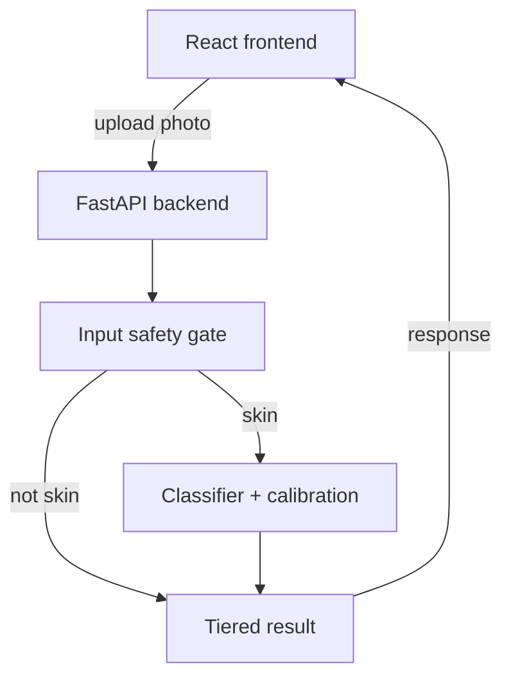
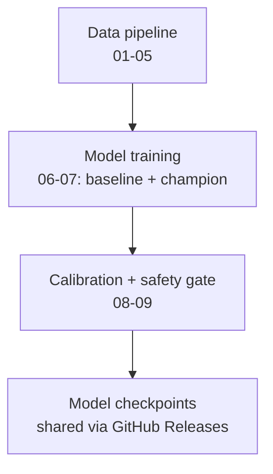

# SafeDerm — System Design

## 1. Purpose and scope

SafeDerm is an AI-assisted skin lesion triage system. It classifies a
dermatoscopic image into one of 7 diagnostic categories, groups the
result into a malignant/benign risk band, and routes it through a
calibrated 3-tier confidence system rather than presenting a raw
probability.

**This is a screening aid, not a diagnostic tool.** It covers 7 specific
lesion types (closed-set classification) and is not designed to
recognize other skin conditions. Full framing in `docs/decisions/ADR-001`.

## 2. High-level architecture



A single request flows through two independent safety layers before a
result is ever returned:

1. **Input safety gate** — a lightweight binary classifier (MobileNetV2)
   that answers "is this even skin?" *before* the diagnostic model sees
   the image. Closed-set classifiers will confidently misclassify
   anything, including a photo of a shoe — this layer exists specifically
   to catch that. See `ADR-006`.
2. **Classifier + calibration** — the 7-class model (ResNet-50 baseline,
   or the CNN+Transformer champion if it wins the comparison in `07`)
   produces a diagnosis, which is then temperature-scaled and mapped to
   a 3-tier confidence band based on calibrated malignant probability,
   not raw top-1 confidence. See `ADR-005` (baseline vs champion) and
   `08_calibration_conformal.ipynb`.

## 3. Offline training pipeline



| Stage | Notebooks | Output |
|---|---|---|
| Data pipeline | `01_data_extraction` → `05_pipeline` | Lesion-level train/val/test splits, PyTorch `Dataset`/`DataLoader` |
| Model training | `06_baseline_model`, `07_champion_model` | Trained checkpoints, compared head-to-head on the same test set |
| Calibration + safety | `08_calibration_conformal`, `09_input_gate` | `calibration_config.json` (temperature + tier thresholds), gate checkpoint |
| Deployment | — | Checkpoints published as GitHub Releases, downloaded by whoever builds `/predict` |

Every notebook is phase-gated — each depends only on the previous
stage's saved output (split CSVs, checkpoints), never on re-running
earlier notebooks live.

## 4. Component breakdown

### 4.1 Data layer
- **HAM10000** — primary dataset, 10,015 dermatoscopic images, 7 classes.
  Known limitation: skews toward lighter Fitzpatrick skin types (`ADR-006`).
- **STL-10** — negative class for the input gate (resolution-matched to
  avoid a shortcut-learning trap CIFAR-10 fell into — see `ADR-006`).
- **Team-collected skin photos** — real, tonally-diverse phone photos
  added to the gate's positive class to counter HAM10000's narrow
  demographic and lighting range.

### 4.2 `src/` — single source of truth
All reusable logic lives here; notebooks import from it rather than
redefining it, so training code, evaluation code, and (eventually)
serving code never drift apart.

| Module | Responsibility |
|---|---|
| `config.py` | All file paths and shared constants |
| `labels.py` | Class list, malignant/benign grouping (`ADR-004`) |
| `transforms.py` | Image preprocessing/augmentation, shared by training and inference |
| `dataset.py` | `SkinLesionDataset` — wraps split CSVs + images |
| `model.py` / `champion_model.py` | Baseline (ResNet-50) and champion (CNN+Transformer) architectures |
| `gate_model.py` / `gate_dataset.py` | Input safety gate architecture and dataset |
| `engine.py` | Model-agnostic train/eval loops, reused by every model |
| `calibration.py` | Temperature scaling, ECE/MCE/Brier score |

### 4.3 Model layer
- **Baseline** — ResNet-50, ImageNet-pretrained, weighted loss (`ADR-005`).
- **Champion** — same ResNet-50 backbone feeding a Transformer encoder
  over spatial regions, letting the model relate distant parts of a
  lesion (border irregularity, multiple color zones) instead of only
  local texture.
- **Input gate** — MobileNetV2, binary skin/not-skin classifier, trained
  separately from the diagnostic model (`ADR-006`).

### 4.4 Backend / serving layer (planned)
FastAPI `/predict` endpoint. Request handling:

```python
def predict(image):
    if not gate_model_says_skin(image):
        return {"status": "rejected", "reason": "not skin"}

    logits = classifier(image)
    calibrated_probs = softmax(logits / temperature)
    tier = assign_tier(calibrated_probs, malignant_classes)
    return {"diagnosis": ..., "tier": tier, "confidence": ...}
```

Both the gate and the classifier use the exact same
`get_eval_transforms()` from `src/transforms.py` — no separate
preprocessing path to maintain or drift out of sync.

### 4.5 Frontend layer (planned)
React upload UI, 3-tier result display, error states for rejected
(non-skin) uploads.

## 5. Technology stack

| Layer | Technology |
|---|---|
| Model training | PyTorch, torchvision |
| Data handling | pandas, scikit-learn (splits, metrics) |
| Backend | FastAPI, Docker |
| Frontend | React |
| Deployment | Render / Hugging Face Spaces (free tier) |
| Model distribution | GitHub Releases |
| Documentation | ADRs (`docs/decisions/`), this document |

## 6. Design decisions

Every significant decision is recorded as an ADR — this document
describes the resulting shape of the system; the ADRs record *why* it
took that shape.

| ADR | Decision |
|---|---|
| 001 | Business problem framing |
| 002 | Technical architecture |
| 003 | Lesion-level, stratified dataset split |
| 004 | Malignant/benign risk grouping |
| 005 | Class imbalance handling (weighted loss) |
| 006 | Two-layer input safety gate |

## 7. Known limitations

- **Closed-set classification** — only recognizes 7 specific lesion
  types; not general dermatology diagnosis.
- **Input gate is not bulletproof** — a sufficiently unusual edge case
  could still pass both safety layers (`ADR-006`).
- **Dataset skin-tone bias** — HAM10000 skews toward lighter Fitzpatrick
  types; this affects the diagnostic model, not only the gate.
- **Academic-scale compute and data** — a 4-person team's dataset and
  training budget, not a production-grade medical device.

These are stated here deliberately, not omitted — a project that names
its own limitations precisely is stronger in review than one that
implies it has none.
